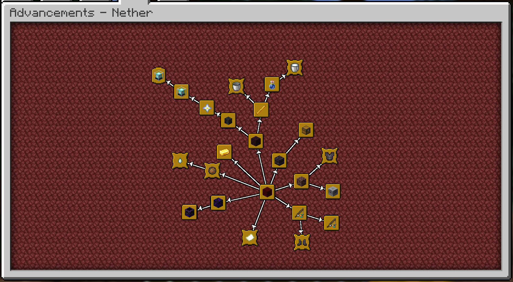
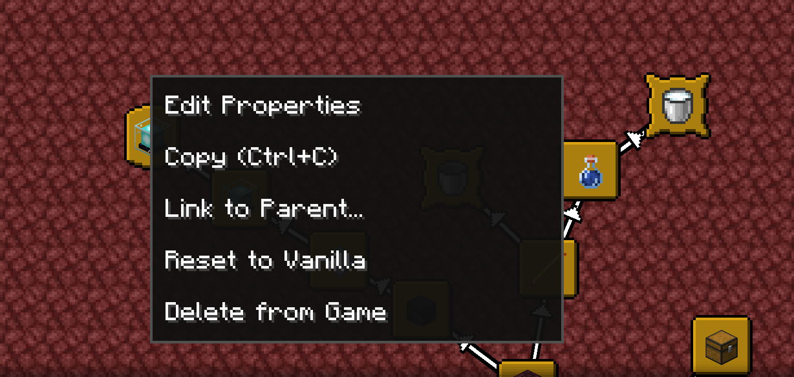
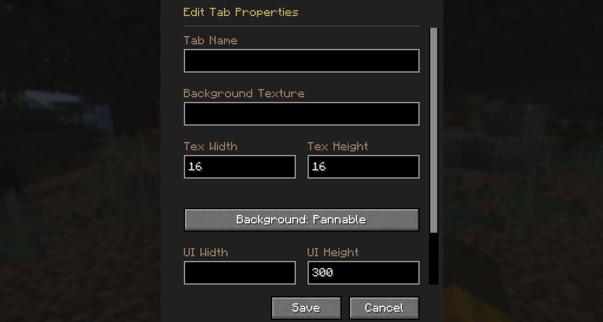
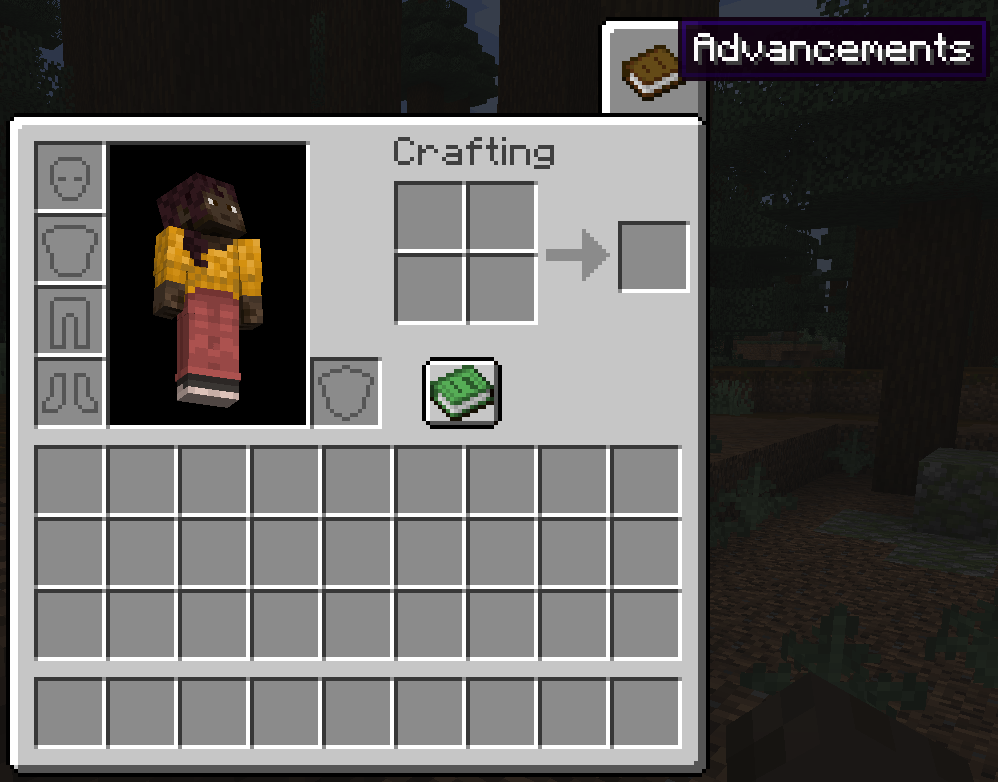
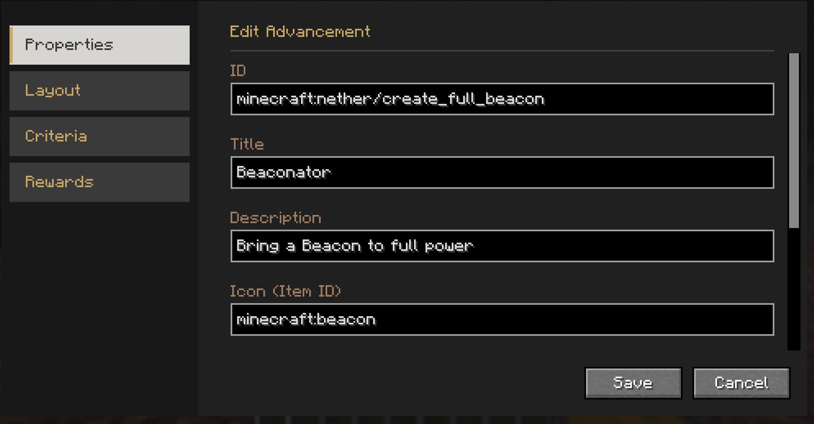
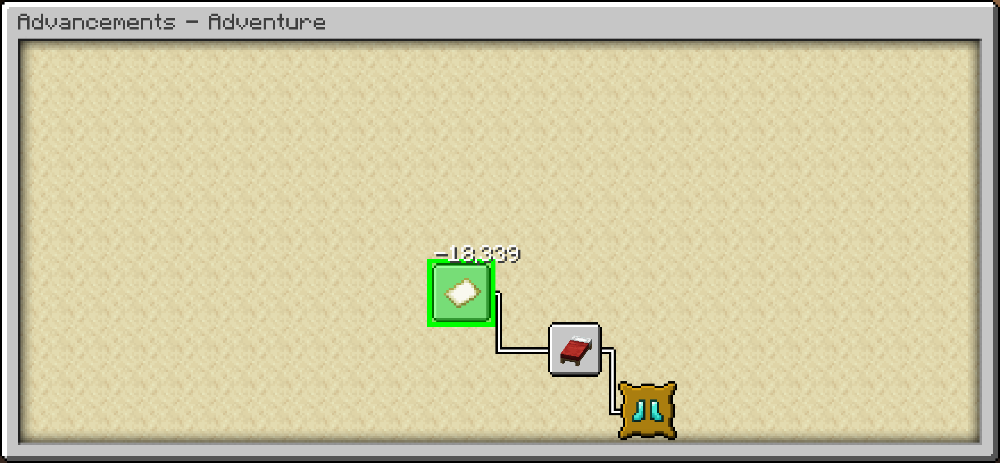

# Reliable Advancements

A client-side mod (with optional server-side integration for Advancement editing) that overhauls the Advancements
screen, provides quality-of-life improvements, extensive customization, and in-game editing tools.

## Features

### Advancement Customization

* **Freely move advancements around**, to wherever you'd like! They'll even save their positions.
* **Choose how advancements connect**! You can toggle connection arrows, use direct straight
  lines, or hide the lines entirely.

* **Fully customize the colors** for a personalized look:
    * Completed and uncompleted connection lines
    * Completed and uncompleted icons
    * Completed and uncompleted titles

### UI Improvements

* Configurable Advancement window UI size (much larger than the vanilla one, by default).
* Additional control options in the Advancement Window!
    * Middle mouse drag to freely pan.
    * Shift-scroll to scroll left and right.
    * Control-scroll to zoom out and in.
* Open the advancements tab directly from the inventory screen! Includes options to customize the
  button style, texture, and position.
* View detailed criteria for each advancement directly in the UI.
* Option to sort advancement tabs alphabetically or by IDs.

### Editing Mode

* Comes with a powerful built-in editor allowing you to modify advancement layouts and advancement properties natively
  in-game.
* You can freely add, modify, or remove advancements directly from the Advancement screen!

---

## Credits

This mod is built upon the incredible work of previous advancement UI mods.

* **[Better Advancements](https://github.com/way2muchnoise/BetterAdvancements)**

  This mod started as a fork of Better Advancements and contains all the features from that mod. Their original code is
  used under their **[Don’t Be a Jerk](https://github.com/way2muchnoise/BetterAdvancements/blob/master/LICENSE.md)
  non-commercial care-free license**.

* **[Advancements Arranged](https://github.com/Seraphaestus/AdvancementsArranged/tree/main)**

  Portions of code used and adapted under their
  **[MIT License](https://github.com/Seraphaestus/AdvancementsArranged/blob/main/TEMPLATE_LICENSE.txt)**.

## License

---

 
